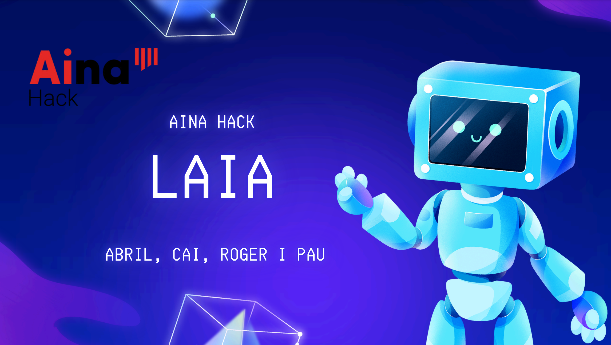

# LaIA
> Making the Catalan administration more accessible to youngsters (and everyone in general!)

*LaIA* is an AI assistant that was developed to make the catalan administration more accessible. It's the result of 24 hours of hard work at the [AinaHack](https://cidai.eu/ainahack/) 2024 hackathon, and was declared the winner project! 🏆

You can find more information at [overview](#overview)

<p align="center">
  
</p>


## File structure

        ├──LaIA_app.py
        ├──LaIA_dialogue.py
        ├──LaIA_document_manager.py
        ├──LaIA_select_best_sources.py
        ├──LaIA_video.py
        ├──LaIA_web_search.py
        ├──final_video_with_subtitles.mp4
        ├──README.md
        ├───generated_images
        │       hivernacle_agricultura.png
        │       mercat_agricultura.png
        │       ramat_agricultura.png
        │       tractor_agricultura.png
        ├───images
        │   ├───agricultura_i_ramaderia
        │   ├───cultura_i_lleure
        │   ├───educació_i_formació
        │   ├───família_i_serveis_socials
        │   ├───habitatge
        │   ├───justícia_i_seguretat
        │   ├───medi_ambient
        │   ├───mobilitat_i_transport
        │   ├───salut
        │   └───treball_i_empresa
        ├───static
        │   ├───audio
        │   └───video
        │           final_video_with_subtitles.mp4
        ├───templates
        │       index.html
        ├───temp_audio
        └───uploads


### Description of files and folders

- **images**: images generated by AI to be used for the background of the video
- **static**: files for the Flask web app
- **templates**: files for the Flask web app
  - `index.html`: main website file, with HTML, CSS and JS
- `LaIA_app.py`: launches the app (the Flask server)
- `LaIA_dialogue.py`: dialogue generation for the video
- `LaIA_document_manager.py`: RAG manager for LaIA
- `LaIA_select_best_sources.py`: code to help LaIA decide the best websites to save information from
- `LaIA_video.py`: video generation code (audio + images)
- `LaIA_web_search.py`: web searcher using LaIA to extract rellevant links...
- `final_video_with_subtitles.mp4`: video generated

## Overview

AinaHack is hackathon organized by the [Barcelona Supercomputing Center](https://www.bsc.es/ca) and [Eurecat](https://eurecat.org/home/), with the support of [i2cat](https://i2cat.net/?lang=ca), [Generalitat de Catalunya](http://politiquesdigitals.gencat.cat/ca/inici), [CIDAI](https://cidai.eu/) and many more. Its goal was to solve the challenges that the administration faces, using the resources developed by [Projecte Aina](https://projecteaina.cat/ainahack/), whose goal is to encourage the use of the catalan language in the digital sphere.

This resources included diferent models and datasets available as [AinaKit](https://langtech-bsc.gitbook.io/aina-kit/aina-hack/general-info).

**LaIA**'s primary goal was to be able to make information more accessible and clear to the public, especially young people. As young people ourselves, we felt that many procedures were difficult to understand, and in general, it was challenging to access information. To address this, we designed a system with two main components:
- **Web search** augmented with AI, in the style of Perplexity or the recent GPT Search, where given a query, the LLM would perform a search, select the links with rellevant information and be able to provide a complete response with citations.
- **Video generation** to be able to spread information more easily, summarizing the found information in a nice conversation (similar to NotebookLM podcast generation) that could be used as an engaging way to interact with the administration and in social networks popular among young people like TikTok.

### Models used

LaIA uses some of the models from [Projecte Aina](https://huggingface.co/projecte-aina):
- [Salamandra 7b instruct - aina hack](https://huggingface.co/BSC-LT/salamandra-7b-instruct-aina-hack): LLM multilingual model - used at almost every step of LaIA
- [Matxa tts cat multiaccent](https://huggingface.co/projecte-aina/matxa-tts-cat-multiaccent): Text-to-speech multispeaker multidialectal model - used to generate the video audio / audio responses
- [Faster-whisper-large 3catparla](https://huggingface.co/projecte-aina/faster-whisper-large-v3-ca-3catparla): Speech-to-text model - used to understand audio questions from user* (not in final project due to some problems)
- [ST-NLI ca mpnet base](https://huggingface.co/projecte-aina/ST-NLI-ca_paraphrase-multilingual-mpnet-base?ref=eligeia.com&utm_source=eligeia&utm_medium=referral): Sentence transformer - used to generate RAG embeddings

Additionally, it also uses Tesseract to perform OCR in images, and optionally [all-MiniLM-L6-v2](https://huggingface.co/sentence-transformers/all-MiniLM-L6-v2) for RAG. The RAG system was created using  [Langchain](https://www.langchain.com/) and uses a [FAISS](https://python.langchain.com/docs/integrations/vectorstores/faiss/) backend.

## How does it work


Given a query, the system first searches its RAG database to see if it already has that information. If it considers that the current information isn't enough, it performs a web search using 3 different terms. It is able to access multiple links, and sublinks inside pages. After that, it looks which pages containg useful information and adds them to the database. Note that the search prioritizes websites ending gencat.cat, since it's intended use case was for the catalan administration.

After that, the response is generated using the new context from the RAG database and including the website where it comes from.

The user is also able to add his own webpages to the database, as well as images and pdfs.

If he wants, he then can prompt the assistant to create a video. It's going to generate a dialogue, transform it to speech, find the most similar images for it and put it all together.

## Use

The `requirements.txt` file contains all the needed libraries. You can install them by doing:

```
pip install -r requirements.txt
```

You also need to set-up a `.env` file with:
- HF_TOKEN
- BASE_URL
- MATCHA_URL
- WHISPER_URL
  
In the hackathon, we were provided with Huggingface inference endpoints (and those URLs point there). After everything is configured, using the assistant should be as easy as executing `LaIA_app.py` and opening localhost.

## Examples
Here are some examples of LaIA interactions, as well as a video.

[](https://github.com/pauhidalgoo/LaIA/raw/refs/heads/main/final_video_with_subtitles.mp4)

<p align="center">
  
</p>

## Authors
This project was created by [Roger Baiges Trilla](https://github.com/rogerbaiges), [Abril Risso Matas](https://github.com/abrilrisso), [Cai Selvas Sala](https://github.com/caiselvas) and [Pau Hidalgo Pujol](https://github.com/pauhidalgoo), students of Artificial Intelligence at UPC-Barcelona Tech.